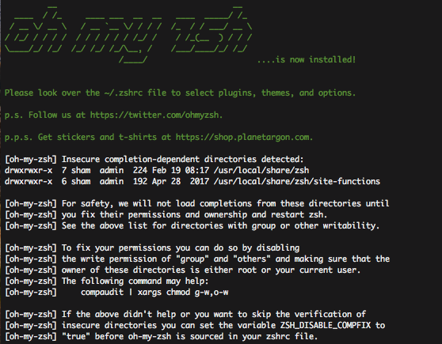
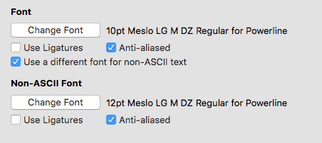

# oh-my-zsh 설치 및 테마 변경
bash를 아름답게 사용할 수 있도록 도와 주는 `oh-my-zsh` 설치 및 설정 가이드

# zsh 와 oh-my-zsh 설치
## step 1
`mac: brew`, `linux: apt-get`
* 각 os에 맞춰 zsh를 설치 해줄 패키지관리자를 업데이트 또는 설치 해준다.

```bash
$ /usr/bin/ruby -e "$(curl -fsSL https://raw.githubusercontent.com/Homebrew/install/master/install)"
```

## step 2
`zsh` 최신 버전 설치
```bash
$ brew install zsh
```

## step 3
[oh-my-zsh](http://ohmyz.sh) 최신 버전 설치
```bash
$ sh -c "$(curl -fsSL https://raw.github.com/robbyrussell/oh-my-zsh/master/tools/install.sh)"
```

* 설치 완료 모습
아래와 같은 모습을 보여주기 시작한다면 성공!



## step 4
### 테마 적용하기!
* 사용할 수 있는 테마 리스트는 [링크](https://github.com/robbyrussell/oh-my-zsh/wiki/External-themes)에서 확인 할 수있다.
* git 사용자에게 좋은 [AgnosterZak](https://github.com/robbyrussell/oh-my-zsh/wiki/External-themes#agnosterzak) 적용

### agnoster 적용 하기
`.zshrc`의 ```ZSH_THEME="robbyrussell"```값을 적용하고자 하는 테마 이름(`agnoster`)으로 수정해 준다.
```bash
$ vi ~/.zshrc
```

터미널 재시작 또는 아래와 같이 source 명령을 통해 적용 해준다.
```bash
$ source ~/.zshrc
```

적용 되었을 경우, 아래와 같이 폰트가 깨는 현상은 만나 볼 수도 있다.


폰트 깨짐을 해결하기 위해서는 [Powerline-patched font](https://gist.github.com/agnoster/3712874) 설치가 필요 하다
설치 방법은 링크를 따라가서 따라하면된다.
mac의 경우, 폰트 적용은 설치후 iterm에 아래처럼 `Meslo LG M DZ Regular for Powerline`을 적용 해주면 된다.



이후, 아래와 같은 문구가 터미널 열때마다 뜬다면
```bash
Last login: Tue Feb 19 08:55:17 on ttys013
[oh-my-zsh] Insecure completion-dependent directories detected:
drwxrwxr-x  7 sham  admin  224 Feb 19 08:17 /usr/local/share/zsh
drwxrwxr-x  6 sham  admin  192 Apr 28  2017 /usr/local/share/zsh/site-functions

[oh-my-zsh] For safety, we will not load completions from these directories until
[oh-my-zsh] you fix their permissions and ownership and restart zsh.
[oh-my-zsh] See the above list for directories with group or other writability.

[oh-my-zsh] To fix your permissions you can do so by disabling
[oh-my-zsh] the write permission of "group" and "others" and making sure that the
[oh-my-zsh] owner of these directories is either root or your current user.
[oh-my-zsh] The following command may help:
[oh-my-zsh]     compaudit | xargs chmod g-w,o-w

[oh-my-zsh] If the above didn't help or you want to skip the verification of
[oh-my-zsh] insecure directories you can set the variable ZSH_DISABLE_COMPFIX to
[oh-my-zsh] "true" before oh-my-zsh is sourced in your zshrc file.
```


`ZSH_DISABLE_COMPFIX`를 true값으로 .zshrc에 적용 해주면 된다.
```bash
ZSH_DISABLE_COMPFIX=true 
```

prompt에서 나오는 hostname/user네임을 없애거나 추가적인 기능을 넣고 싶다면, 아래의 파일을 열어 수정해주면 된다
```bash 
$ vi ~/.oh-my-zsh/themes/agnoster.zsh-theme
```

멀티 라인을 추가 하고 싶다면 아래와 같이 수정 [링크참고](http://totuworld.github.io/2016/04/08/zsh2line/)
```bash
## Main prompt
build_prompt() {
  RETVAL=$?
  prompt_status
  prompt_virtualenv
  prompt_context
  prompt_dir
  prompt_git
  prompt_bzr
  prompt_hg
  prompt_newline # 멀티라인 적용
  prompt_end
}

# 멀티라인 적용, 커버모양 변경
prompt_newline() {
  if [[ -n $CURRENT_BG ]]; then
    echo -n "%{%k%F{$CURRENT_BG}%}$SEGMENT_SEPARATOR
%(?.%F{$CURRENT_BG}.%F{red})❯%f"

  else
    echo -n "%"
  fi

  echo -n "%"
  CURRENT_BG=''
}
```

prompt에 prefix로 붙는 hostname이 맘에 안든다면 아래를 적용하면 된다
```bash
# Context: user@hostname (who am I and where am I)
prompt_context() {
   if [[ "$USER" != "$DEFAULT_USER" || -n "$SSH_CLIENT" ]]; then
     # prompt_segment black default "%(!.%.)%n@%m"
     prompt_segment black default "%(!.%.)%n"
  fi
}
```

# 자동완성 플러그인 [zsh-autosuggestions](https://github.com/zsh-users/zsh-autosuggestions) 설치
1. `git clone`을 통해 코드를 zsh plugin에 받아온다.
```bash
$ git clone https://github.com/zsh-users/zsh-autosuggestions $ZSH_CUSTOM/plugins/zsh-autosuggestions
```
2. `.zshrc`에 아래와 같이 수정 해준다.
```bash
plugins=( git zsh-autosuggestions )
```

3. 터미널 재시작 또는 `source .zshrc`를 하면 적용되어 있는 것을 볼 수 있다!
# 별거 아니지만 팁
* /bin/bash 와 /bin/zsh에 모두 적용하고 싶은 `xxxrc`가 있다면 .rc_profile과 같은 녀석을 만들어 `xxxxrc`에서 불러주면 편해진다
* bash와 zsh를 모두 이용할때 좋음